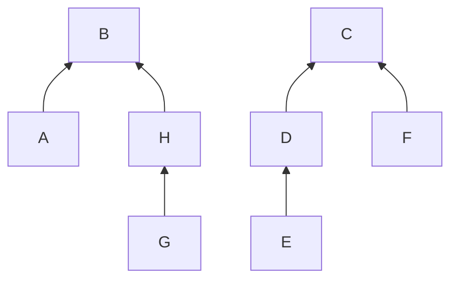

# VisDSR

**Evaluating DSU Reasoning from Text and Diagrams**

[Results](MAIN_RESULTS.md) · [Scored response examples](RESPONSE_EXAMPLES.md) · [Reproduce](REPRODUCE_MAIN.md) · [Data release](https://github.com/Abhishekgit01/VisDSR/releases/tag/v2.0-results)

VisDSR studies sequential reasoning over disjoint-set union (DSU) forests. It asks how model accuracy changes when the same starting state is supplied as a parent map, an image of that map, or a forest diagram. Two additional conditions ask the model to transcribe the initial state before applying operations.

DSU makes every intermediate state checkable while requiring path compression, set-size comparisons, and a fixed union tie rule. A C++ simulator supplies ground truth, and an independent Python reference checks it.

## Current results

Both main runs are complete and audited: **400 Qwen + 400 InternVL responses**, with 80 per condition for each model. Both calibrations are also complete.

| Main condition | Qwen correct final maps | InternVL correct final maps |
| --- | ---: | ---: |
| T-dir | 0/80 | 2/80 |
| R-dir | 0/80 | 0/80 |
| G-dir | 0/80 | 0/80 |
| T-str | 3/80 | 2/80 |
| G-str | 0/80 | 0/80 |

Qwen has 3/400 correct final maps and 138 format failures; InternVL has 4/400 and 281. Raw responses were scored without repairs or retries. Low accuracy and frequent schema failures limit interpretation and do not establish modality equivalence.

The [main report](MAIN_RESULTS.md) records the paired analysis, output caps, recovery audit, and reproduction limits. The primary T-dir minus G-dir differences are 0.00 and 2.50 percentage points, respectively; both Holm-adjusted exact p-values are 1.00.

### See an actual model answer

The [three scored response examples](RESPONSE_EXAMPLES.md) compare a correct answer, a path-compression error, and a schema failure on one shared main task. Each includes the original response, expected state, and exact scoring decision. These are selected illustrations, not an accuracy sample.

The separate calibration results are:

| Model | Calibration responses | Correct final maps | Format failures |
| --- | ---: | ---: | ---: |
| Qwen3-VL-8B-Instruct | 60/60 | 2/60 | 18/60 |
| InternVL3.5-8B-HF | 60/60 | 1/60 | 38/60 |

Qwen's calibration text and diagram conditions scored 2/12 and 0/12; InternVL scored 0/12 in both. Low baseline accuracy and frequent format failures limit interpretation of a modality comparison. The [main-study decision](MAIN_DECISION.md) records these limits and the rationale for collecting fresh tasks. The protocol remains frozen.

Calibration covers 8 or 16 elements and one or four operations. The [study design](STUDY_V2.md) is the preserved plan written before these calls. The [calibration results and run log](V2_SMOKE.md) records subsequent observations and resume instructions. Earlier runs are documented in the [pilot and feasibility report](REPORT.md).

## Study design

| Condition | Initial state | Additional output |
| --- | --- | --- |
| T-dir | Canonical JSON parent map | None |
| R-dir | PNG of the same JSON string | None |
| G-dir | Forest diagram with child-to-parent arrows | None |
| T-str | Canonical JSON parent map | Initial-map transcription |
| G-str | The same diagram as G-dir | Initial-map transcription |

All conditions use identical operations and require the parent map after each operation, plus every `find` result. Transcription is a JSON object. Invalid output counts as incorrect; responses are preserved without repairs or content retries.

### Worked example

The first operation in calibration task `pilot2_0004` is `find(E)`. Its initial parent map is:

```json
{"A":"B","B":"B","C":"C","D":"C","E":"D","F":"C","G":"H","H":"B"}
```

The same forest is shown below. Arrows point from child to parent; roots `B` and `C` point to themselves.



`find(E)` follows `E → D → C`, returns `C`, and changes `E`'s parent to `C` through path compression. The expected state after this operation is:

```json
{"A":"B","B":"B","C":"C","D":"C","E":"C","F":"C","G":"H","H":"B"}
```

The [exact diagram input](docs/examples/dsu-forest.png) and [complete task with expected answers](docs/examples/dsu-task.json) are included. The PNG is copied unchanged from the audited calibration input. The diagram above illustrates the forest for this README; model calls use the original PNG. These are simulator answers, and model responses are scored against them.

The completed main study has 80 fresh tasks, five conditions, and two open-weight families: [Qwen3-VL-8B-Instruct](https://huggingface.co/Qwen/Qwen3-VL-8B-Instruct) and [InternVL3.5-8B-HF](https://huggingface.co/OpenGVLab/InternVL3_5-8B-HF). That is 800 independent responses. Models use pinned revisions, local 4-bit NF4 weights, and greedy decoding. No paid inference API is used.

The primary measure is final-parent-map exact match. The primary comparison is **T-dir minus G-dir**, paired by task. Secondary measures include full-sequence correctness, transcription accuracy, and format errors. The [freeze record](FREEZE.json) contains the audited calibration summaries and protected source hashes.

## Reproduce the main results

Download the audited archive and checksums from the [results release](https://github.com/Abhishekgit01/VisDSR/releases/tag/v2.0-results). In a fresh results-tag checkout, install the base dependencies, restore the archive, and recompute:

```bash
python -m pip install -r environment/requirements.txt
python -m study_transfer --restore visdsr-main-results.zip
python -m eval.run --split main --model model1 --score-only
python -m eval.run --split main --model model2 --score-only
python -m analysis.analyze --split main --models model1 model2
```

The [reproduction guide](REPRODUCE_MAIN.md) includes dependency installation, download and checksum commands, calibration replay, and byte-for-byte CSV comparison. No model weights, GPU, API key, or paid service is needed for cached scoring. [Citation metadata](CITATION.cff) is included.

## Inference replication

Official collection is complete. The [Kaggle and inference guide](docs/INFERENCE.md) explains the retained notebooks, bounded runner, cache reuse, and durable backups. Re-running weights is a separate hardware-dependent replication; use cached scoring above to reproduce the published results.

## Check locally

Requires Python 3.11+, a C++17 compiler, Graphviz, and DejaVu fonts.

```bash
python -m pip install -r environment/requirements.txt
make build
make test
make lint
make stress
```

`make test` checks validation, caching, archive recovery, notebooks, and mocked provider calls. `make stress` checks the worked examples and 5,000 seeded simulator cases against an independent Python reference. [CPU checks](https://github.com/Abhishekgit01/VisDSR/actions/workflows/checks.yml) run these commands and verify the frozen source hashes on pushes and pull requests. The [inference guide](docs/INFERENCE.md#check-task-generation-locally) also covers local task generation and mock scoring.

| Path | Purpose |
| --- | --- |
| [`sim/dsu.cpp`](sim/dsu.cpp) | DSU simulator and operation protocol |
| [`gen/`](gen/) | Seeded tasks, rendering, validation, and freeze audit |
| [`eval/`](eval/) | Shared prompts, local inference, caching, and strict scoring |
| [`analysis/`](analysis/) | Paired statistics and figures |
| [`study_transfer.py`](study_transfer.py) | Checked v2 backup export and restore |
| [`tests/`](tests/) | Independent DSU reference and infrastructure checks |
| [Algorithm explanation and implementation provenance](STUDENT_UNDERSTANDING.md) | DSU rules, condition controls, and AI-assisted work |

## Documentation and history

The [documentation index](docs/README.md) separates the completed study from the preserved planning documents, calibration logs, and historical v1 feasibility results. Historical responses are not pooled with v2.

Complete generated datasets and raw-response archives are distributed as release assets. Small reviewed examples are included in the repository documentation.

## License and citation

Repository code is available under the [MIT license](LICENSE). Downloaded model weights retain their upstream licenses. [Citation metadata](CITATION.cff) identifies the completed study and results release.
