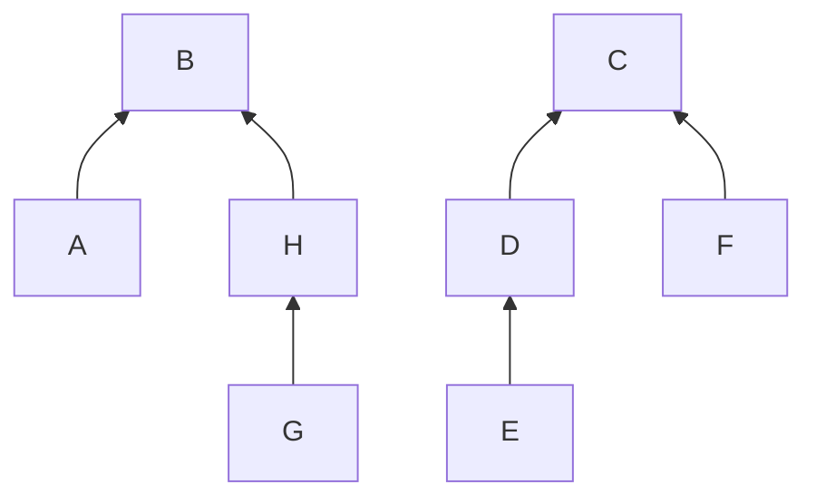

# VisDSR

**Evaluating DSU Reasoning from Text and Diagrams**

VisDSR studies sequential reasoning over disjoint-set union (DSU) forests. It asks how model accuracy changes when the same starting state is supplied as a parent map, an image of that map, or a forest diagram. Two additional conditions ask the model to transcribe the initial state before applying operations.

DSU makes every intermediate state checkable while requiring path compression, set-size comparisons, and a fixed union tie rule. A C++ simulator supplies ground truth, and an independent Python reference checks it.

## Current results

Calibration is complete. The latest reviewed backup contains:

| Model | Calibration responses | Correct final maps | Format failures |
| --- | ---: | ---: | ---: |
| Qwen3-VL-8B-Instruct | 60/60 | 2/60 | 18/60 |
| InternVL3.5-8B-HF | 60/60 | 1/60 | 38/60 |

Qwen's text and diagram conditions scored 2/12 and 0/12; InternVL scored 0/12 in both. Low baseline accuracy and frequent format failures limit interpretation of a modality comparison. The [main-study decision](MAIN_DECISION.md) records these limits and the rationale for collecting fresh tasks. The protocol is frozen; no main model responses have been collected.

Calibration covers 8 or 16 elements and one or four operations. The [study design](STUDY_V2.md) is the preserved plan written before these calls. The [calibration results and run log](V2_SMOKE.md) records subsequent observations and resume instructions. Earlier runs are documented in the [pilot and feasibility report](REPORT.md).

The current project is published on `main`. Protocol version numbers distinguish the earlier pilots from the current experiment.

## Study design

| Condition | Initial state | Additional output |
| --- | --- | --- |
| T-dir | Canonical JSON parent map | None |
| R-dir | PNG of the same JSON string | None |
| G-dir | Forest diagram with child-to-parent arrows | None |
| T-str | Canonical JSON parent map | Initial-map transcription |
| G-str | The same diagram as G-dir | Initial-map transcription |

All conditions use identical operations and require the parent map after each operation, plus every `find` result. Transcription is a JSON object. Invalid output counts as incorrect; responses are preserved without repairs or content retries.

### Worked example

The first operation in calibration task `pilot2_0004` is `find(E)`. Its initial parent map is:

```json
{"A":"B","B":"B","C":"C","D":"C","E":"D","F":"C","G":"H","H":"B"}
```

The same forest is shown below. Arrows point from child to parent; roots `B` and `C` point to themselves.



`find(E)` follows `E → D → C`, returns `C`, and changes `E`'s parent to `C` through path compression. The expected state after this operation is:

```json
{"A":"B","B":"B","C":"C","D":"C","E":"C","F":"C","G":"H","H":"B"}
```

The [exact diagram input](docs/examples/dsu-forest.png) and [complete task with expected answers](docs/examples/dsu-task.json) are included. The PNG is copied unchanged from the audited calibration input. The diagram above illustrates the forest for this README; model calls use the original PNG. These are simulator answers, and model responses are scored against them.

The planned main study has 80 fresh tasks, five conditions, and two open-weight families: [Qwen3-VL-8B-Instruct](https://huggingface.co/Qwen/Qwen3-VL-8B-Instruct) and [InternVL3.5-8B-HF](https://huggingface.co/OpenGVLab/InternVL3_5-8B-HF). That is 800 independent responses. Models use pinned revisions, local 4-bit NF4 weights, and greedy decoding. No paid inference API is used.

The primary measure is final-parent-map exact match. The primary comparison is **T-dir minus G-dir**, paired by task. Secondary measures include full-sequence correctness, transcription accuracy, and format errors. The [freeze record](FREEZE.json) contains the audited calibration summaries and protected source hashes. Preparation does not establish a modality effect.

### Reproduce the calibration scores

The [protocol-freeze release](https://github.com/Abhishekgit01/VisDSR/releases/tag/v2.0-frozen) includes `visdsr-calibration.zip`: the twelve tasks, 24 original images, 120 official raw caches, smoke outputs, and separate diagnostics. Its SHA-256 is `40569d0fb6fb3eea7c626474587a1488f8bf5f6ffb296c543fd3e4cdfde486ee`. It is the audited backup with a descriptive download filename; its bytes are unchanged.

Use a fresh checkout of the `v2.0-frozen` tag so existing local data is preserved. Download the ZIP into that checkout, then run:

```bash
python -m pip install -r environment/requirements.txt
python -m study_transfer --restore visdsr-calibration.zip
python -m eval.run --split pilot2 --model model1 --score-only
python -m eval.run --split pilot2 --model model2 --score-only
python -m analysis.analyze --split pilot2 --models model1 model2
```

These commands recompute calibration scores without a GPU, model weights, or inference. Calibration comparisons are descriptive; they are separate from the planned main analysis. Percentile bootstrap intervals at an accuracy floor can be degenerate and do not establish equivalence.

## Run on Kaggle

For a first run, import the Qwen notebook into Kaggle:

- [`qwen3_vl_v2_kaggle.ipynb`](notebooks/qwen3_vl_v2_kaggle.ipynb)
- [`internvl35_v2_kaggle.ipynb`](notebooks/internvl35_v2_kaggle.ipynb)

1. Download the Qwen notebook from `main` and import it into Kaggle. Enable a free GPU and Internet.
2. Keep `STAGE = "smoke"` and the review flags false. Run the cells from top to bottom. The default makes only three calls: T-dir, R-dir, and G-dir on the same four-operation calibration task.
3. Download `visdsr_v2_results.zip` from the Output panel. Review the raw answers, strict parsing, correctness, tokens, memory, and latency before selecting calibration.
4. After review, calibration runs at most 20 new responses per execution and reuses the smoke cache. Download each updated export. Attach the newest export as a private Dataset when resuming or starting InternVL.

The v2 project folder is `/kaggle/working/VisDSR_v2`. Its backup checks source fingerprints, calibration task bytes, and payload checksums. Earlier v1 exports are incompatible. Both a ZIP and Kaggle's extracted Dataset layout are supported. Exports omit the redundant nested cache ZIP that caused earlier upload problems.

Every completed response is cached immediately; each bounded run also exports automatically. A lost runtime can still lose files that have not been exported and saved outside the session. Do not rely on Kaggle's temporary disk as the only copy.

### Continue to the frozen main study

After restoring the completed calibration, use the standalone [main runner](notebooks/kaggle_main.py) from the project directory:

```bash
python -m notebooks.kaggle_main --model model1 --max-new-calls 100
```

It verifies the freeze and both calibration sets, generates and validates main inputs when missing, and makes at most 100 new Qwen calls. Rerunning resumes; use `model2` for InternVL after Qwen completes. One model runs at a time. Smaller chunks are supported. Each chunk exports automatically, including after a normal interruption. Download the new backup before continuing or ending the session.

At calibration's measured averages, four 100-call chunks per model would require about 12.85 hours for Qwen and 10.24 hours for InternVL, excluding setup and interruptions. Main execution and the final report remain outstanding.

## Check locally

Requires Python 3.11+, a C++17 compiler, Graphviz, and DejaVu fonts.

```bash
python -m pip install -r environment/requirements.txt
make build
make test
make lint
make stress
```

Generate the revised calibration in a separate checkout so historical local data stays intact:

```bash
python -m gen.generate --split pilot2
python -m gen.render --split pilot2
python -m gen.validate --split pilot2
python -m gen.render --split pilot2 --qa
python -m eval.run --split pilot2 --model mock --max-new-calls 20
```

The mock oracle checks caching and scoring without model inference; it supplies no study evidence. `make stress` checks the worked example and 5,000 seeded simulator cases. Image validation checks replayed truth, dimensions, geometry, pixels, filenames, and hashes. Main generation is blocked until the reviewed freeze exists.

| Path | Purpose |
| --- | --- |
| [`sim/dsu.cpp`](sim/dsu.cpp) | DSU simulator and operation protocol |
| [`gen/`](gen/) | Seeded tasks, rendering, validation, and freeze audit |
| [`eval/`](eval/) | Shared prompts, local inference, caching, and strict scoring |
| [`analysis/`](analysis/) | Paired statistics and figures |
| [`study_transfer.py`](study_transfer.py) | Checked v2 backup export and restore |
| [`tests/`](tests/) | Independent DSU reference and infrastructure checks |
| [Algorithm explanation and implementation provenance](STUDENT_UNDERSTANDING.md) | DSU rules, condition controls, and AI-assisted work |

## Historical feasibility results

The v1 code is preserved at commit `bf81065`. Its [`SPEC.md`](SPEC.md) and [`REPORT.md`](REPORT.md) describe a separate protocol, with unchanged official scores:

| Run | T-dir | R-dir | G-dir |
| --- | ---: | ---: | ---: |
| Qwen pilot 1, 12 four-operation tasks | 0/12 | 0/12 | 0/12 |
| Qwen pilot 2, 12 one/two-operation tasks | 1/12 | 0/12 | 0/12 |
| InternVL smoke, one task | 1/1 | 0/1 | 0/1 |

The Qwen text baseline was near zero. InternVL's image outputs began with reasoning text; the diagram response did not finish an answer. These runs did not establish whether diagrams help or hurt DSU reasoning. They motivated clearer output instructions and a representative calibration set for v2. Historical responses will not be pooled with v2.

Reviewed private archive SHA-256 checksums:

- First Qwen pilot: `a7a3eaa8b3d51f1d18ff57bc7bbba97735cdb077da5936bd751ec86e33974fa8`.
- Both Qwen pilots: `f40e0ce44178ef39fb1a87e7ff155d975c31ff270b0ca9ace74ab4390829726b`.
- InternVL smoke plus preserved Qwen data: `25ca9faf910ad1b6cd537dc2ead0993509cc4cf996c111c0fa963e5a76ecb71b`.

The raw responses and generated data remain outside Git. The public repository alone cannot reproduce those historical numerical results. A final v2 release must include a reviewed reproduction artifact or access instructions, along with the frozen code, audited scores, figures, and report. The project uses clean synthetic images and exact-match scoring; these outputs do not identify a model's internal failure mechanism.
